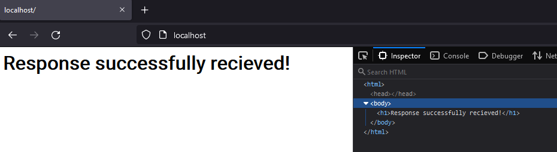

# Webserver from Scratch

Exactly as the title says, the purpose of this is to learn more about how webservers and sockets work.

This is not meant for any real world use, as it does not support HTTPS.

This project will slowly be updated to be more and more up-to-date when I have free time to work on it.

